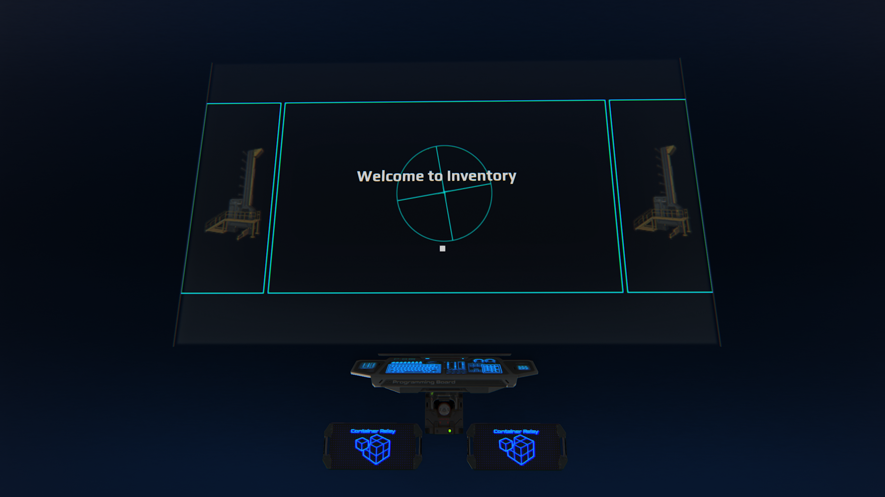
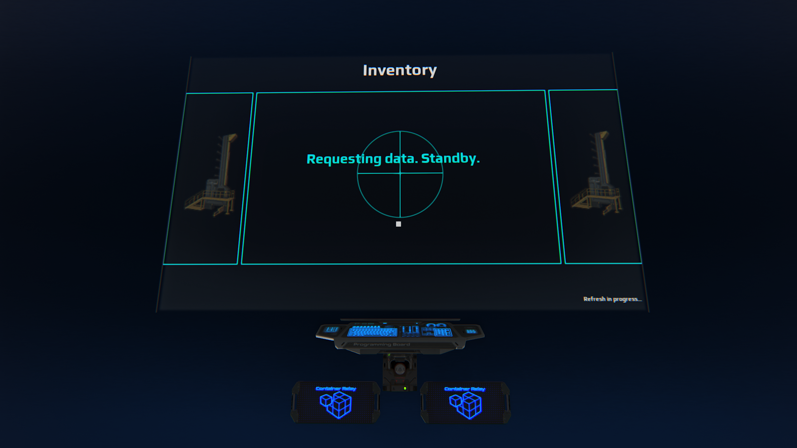
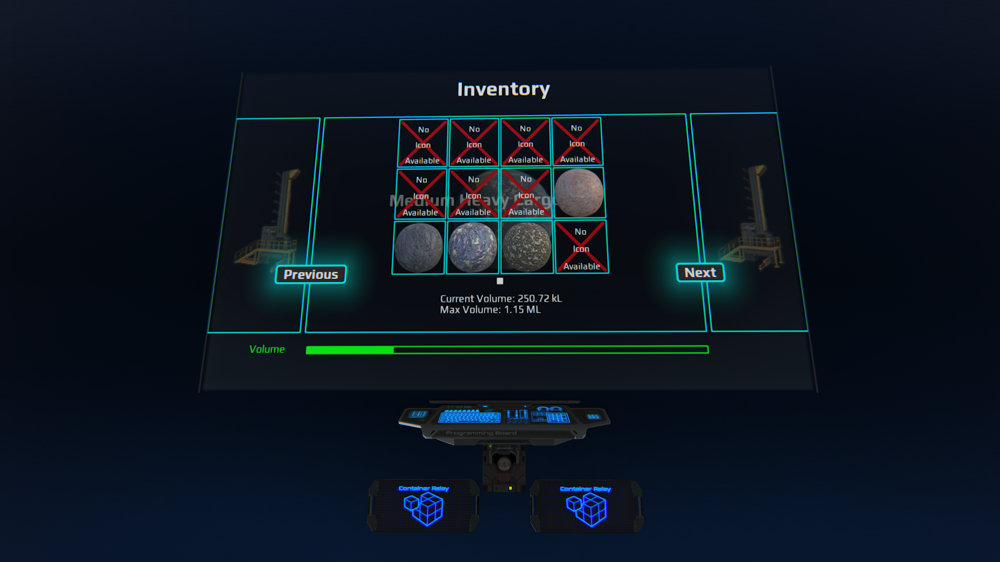
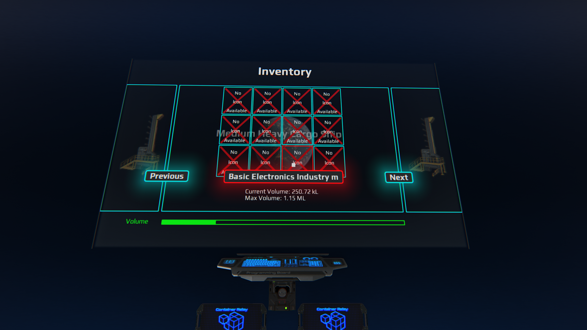
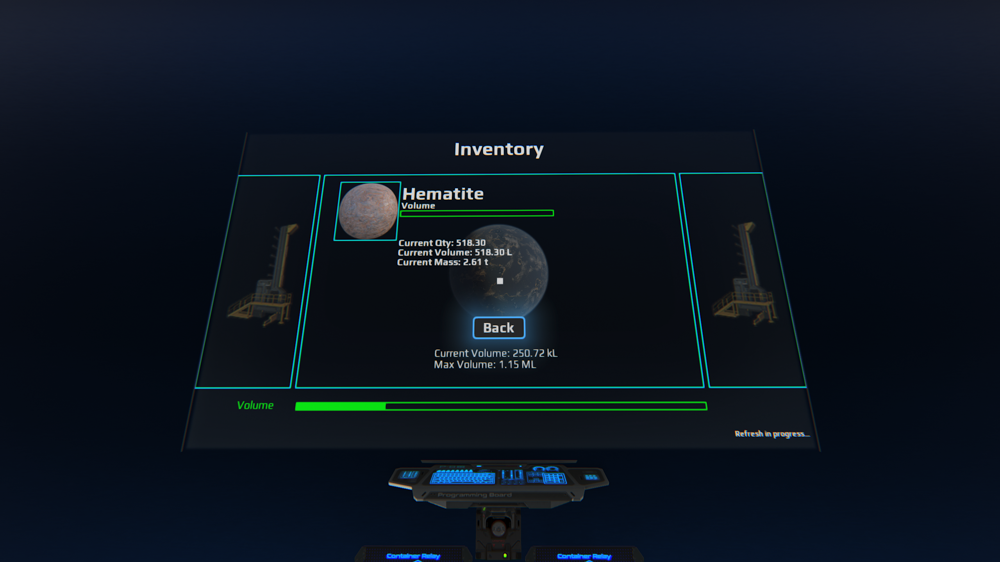
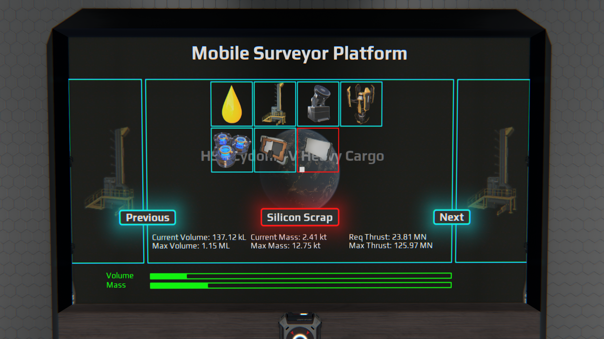
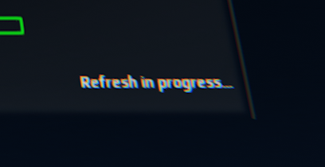
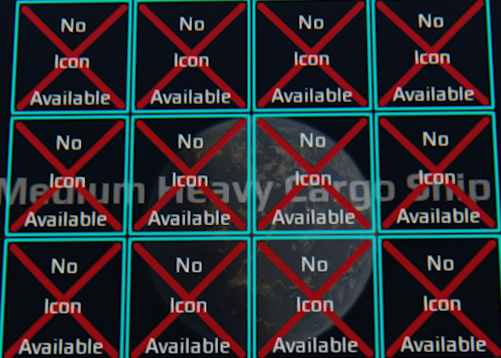
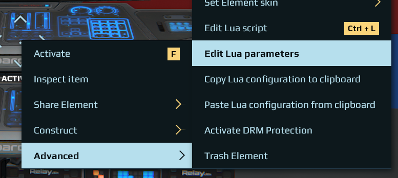
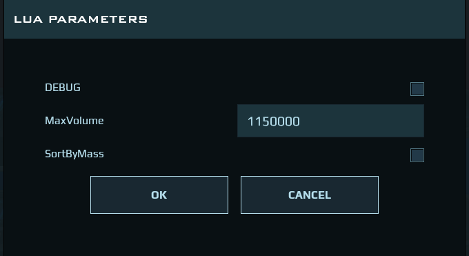

# DU-Inventory-Manager
## Dual Universe Inventory Manager

This project leverages the recently released screen LUA APIs to provide an interface with the programming board.



With this system, you can set up a visual representation of your container(s) on your constructs. Designed to connect up to 8 hubs.



Currently the system is limited to two (2) Containers or hubs per board.

*TODO: decrease memory footprint while processing inventory*

For land based constructs (Static Core), only the current volume and maximum volume is displayed.

!

For ship based constructs (Dynamic Core), the Mass and the thrust are calculated according to your ships data via lua.

!

!

## Things to note about usage



When you see this on the screen, the `Previous` and `Next` buttons will be for the most part ignored. If you click on these buttons and nothing happens, wait until this text is not on the screen and trigger the page change.



If you see this, don't panic. The Image Library is incomplete and is being worked on to add more items on the list. As more time passes, the amount of these icons should decrease significantly. Clicking on the icon will take you to the item page.

## How to Setup
1. Place your programming board and screen at a location of your choosing. It must be on the same core as the containers or hubs.
2. Connect to the programming board in the following order:
    1. Screen
    2. Core
    3. Container or Hub (up to 2)
3. Load the programming board by going to [pb_conf.json](conf/pb_conf.json) and copying the code to your clipboard.
4. In-game, right click the programming board, click Advanced, and select Paste lua from Clipboard.
5. Load the screen next by copying the code in [screen1.lua](src/screen1.lua).
6. Right click the screen, click Advanced, and click Edit Content. On the top right, click LUA to put the screen in LUA mode.
7. Paste the copied code for the screen in the window. Click Apply to save the data.

It is recommended to attach a trigger to turn on the board and the screen at the same time. This can be achieved with a simple Manual Switch attached to a relay that is attached to both the programming board and the screen. Turning on the switch turns on both. You can replace the switch with any trigger device.

## Customizing the screen
Edit the begining of the [screen1.lua](src/screen1.lua) file before you paste it or within the in-game editor and put your title and background text:

```lua
local title = "Inventory" -- export: Name your display.
local bgtext = "Medium Heavy Cargo Ship" -- export: Background text of your choice.
...
```

Do not edit any other options or you will mess with the system's timings.

**IMPORTANT** The Volume calculations depend on a parameter in the programming board.

Right click the programming board, click Advanced, and select Edit Lua Parameters. You will see the following options:






|Parameter|Value|Description|
|---|---|---|
|DEBUG|false|(Default: false) Gives you details to troubleshoot. Turn on at your own risk.|
|MaxVolume|1150000|(Default: 1150000) Put the total maximum volume of your containers in L. 1 kL = 1000 L|
|SortByMass|false|(Default: false) Sorts by Volume or Mass.|

For MaxVolume, be sure to add up the total volume per container attached. Hubs report 0 max volume, so this must be calculated and updated to give you correct numbers.
